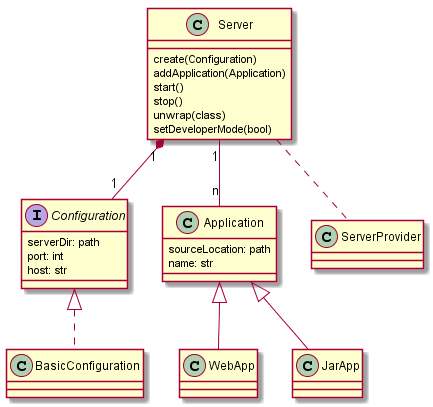

# SeFac

**SeFac** stands for *Server Facade*. 
It's a project to make easier to use embedded application servers in Java.  
Sometimes developers may want to test their codes against several servers. But currently, without *Sefac* it's necessary  to change completely the code that refers to the integration with the server.   

In this scenario, *SeFac* goal is to create an uniform API that:

* Makes client application codes loose coupled to Server implementation
* Reduce GAPs from different server implementations

The idea is based on the well-known *slf4j*.  

## API

> This project is in an initial phase yet, so API can (probably will) change

A brief overview may is shown on the model diagram below:

### Server

* Entry point in the API and main reference.
* Used for operations related to the runtime server, in implementation independent way

### Configuration

> As the name says...

The BasicConfiguration is the programmatically one

### Application

May represent eigher a packed application (war / jar) or an exploded application (set of directories)

## Next Steps (TODOs)

* Add more providers (support more application servers)
* Implements Develop mode features
	* Watch dog
* Consider use an ApplicationBuilder, ensuring required values
* Increase test covering
* Implement other configuration options
	* XML file
	* Declarative (annotations) 
* Improve Doc